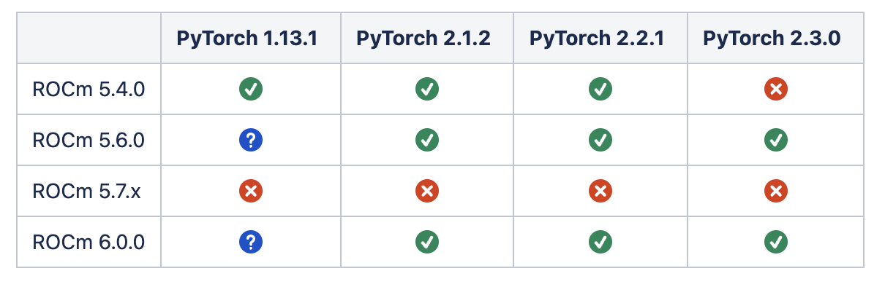

## On rocm/pytorch compatibility




## Basic environment setup

```
ROCM_VER=6.0.0
module load PrgEnv-gnu/8.5.0
module load rocm/6.0.0
module load gcc-native/12.3
module load craype-accel-amd-gfx90a
module load cmake
module load miniforge3/23.11.0-0
module unload darshan-runtime
export HCC_AMDGPU_TARGET=gfx90a
export PYTORCH_ROCM_ARCH=gfx90a
export ROCM_HOME=/opt/rocm-${ROCM_VER}
export CC=cc
export CXX=CC
```


## conda and mpi4py setup

```
conda create -p /sw/aaims/frontier/rocm600-pt230 \
    python=3.10 numpy=1 -c conda-forge

source activate /sw/aaims/frontier/rocm600-pt230
pip install pyyaml typing_extensions ninja packaging

# Optional: install mpi4py
MPICC="cc -shared" pip install --no-cache-dir --no-binary=mpi4py mpi4py
```

## Build pytorch

```
TORCH_VER=release/2.3-frontier
git clone --recursive -b ${TORCH_VER} \
    https://github.com/michael-sandoval/pytorch

cd pytorch

# redundant
#git submodule init
#git submodule update

 
# If using GCC12 to build torch:
export CFLAGS=" -Wno-error=maybe-uninitialized -Wno-error=uninitialized -Wno-error=restrict -Wno-error=nonnull"
export CXXFLAGS=" -Wno-error=maybe-uninitialized -Wno-error=uninitialized -Wno-error=restrict -Wno-error=nonnull"
export BUILD_TEST=OFF


# Generate HIP files
python3 tools/amd_build/build_amd.py


# Set the PyTorch build version
export PYTORCH_BUILD_VERSION="2.3.0"
export PYTORCH_BUILD_NUMBER=1

 
# Point libkineto away from "/opt/rocm" to "/opt/rocm-x.y.z"
cp ./frontier_fixes/third_party/kineto/libkineto/CMakeLists.txt \
    ./third_party/kineto/libkineto/CMakeLists.txt

# Fix "rocm-core/rocm_version.h" reference post HIP conversion (ONLY WHEN USING ROCm < 6.0.0)
<!-- cp ./frontier_fixes/aten/src/ATen/hip/tunable/TunableGemm.h \
    ./aten/src/ATen/hip/tunable/TunableGemm.h -->

# Build PyTorch
USE_ROCM=1 USE_CUDA=OFF USE_NVCC=OFF BUILD_CAFFE2_OPS=0 ROCM_SOURCE_DIR="/opt/rocm-${ROCM_VER}" MAX_JOBS=8 python setup.py bdist_wheel
 
```

After compilation, I have:

```
dist/torch-2.3.0-cp310-cp310-linux_x86_64.whl
```

## Verify

```
pip install dist/*.whl

```

```
>>> import torch
Traceback (most recent call last):
  File "<stdin>", line 1, in <module>
  File "/lustre/orion/stf218/proj-shared/fwang2/pytorch/torch/__init__.py", line 546, in <module>
    raise ImportError(textwrap.dedent('''
ImportError: Failed to load PyTorch C extensions:
    It appears that PyTorch has loaded the `torch/_C` folder
    of the PyTorch repository rather than the C extensions which
    are expected in the `torch._C` namespace. This can occur when
    using the `install` workflow. e.g.
        $ python setup.py install && python -c "import torch"

    This error can generally be solved using the `develop` workflow
        $ python setup.py develop && python -c "import torch"  # This should succeed
    or by running Python from a different directory.
```

